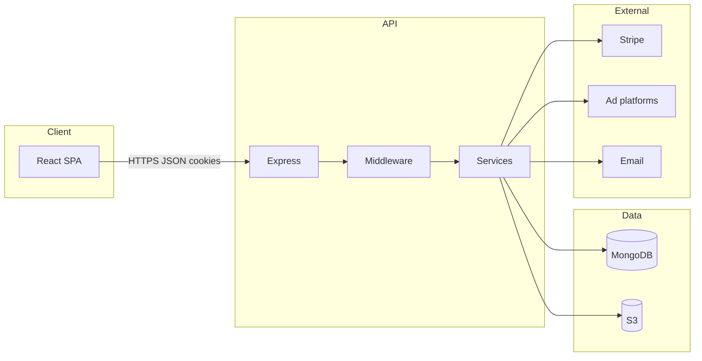

# Technical documentation (thesis — Chapter 5: Development)

This document describes the technical realisation of **JobPulse**: a full-stack web application for recruitment marketing workflows, including campaign ordering, media handling, performance reporting across advertising platforms, and card payments. It is written to support the **Development** chapter of the thesis and reflects the codebase and deployment setup as implemented in this repository.

---

## 5. Development

### 5.1 Technology choices

Technology choices favour a **single language (TypeScript)** across client and server, **mature HTTP APIs**, **document-oriented persistence**, and **managed cloud services** so that development effort stays on product logic rather than low-level infrastructure.

#### 5.1.1 Frontend technologies

The client is a **single-page application (SPA)** built with **React 19** and **TypeScript**, bundled by **Vite 7**. Rationale:

- **React** provides a component model that maps well to reusable UI (dashboards, order flows, charts) and a large ecosystem.
- **TypeScript** catches integration errors early (API payloads, props) and improves maintainability for a thesis-scale codebase.
- **Vite** offers fast local development and optimised production builds (tree-shaking, ES modules), which supports iterative UI work.

Supporting libraries include **react-router-dom** for client-side routing, **axios** for HTTP with `withCredentials: true` so **httpOnly cookies** issued by the API are sent on cross-origin requests in production, **Sass** for styling, **recharts** for analytics visualisation, **react-dropzone** for uploads, and **jsPDF** where PDF generation is needed on the client. **ESLint** enforces consistent code style.

#### 5.1.2 Backend technologies

The API is implemented with **Node.js** and **Express 5**, also in **TypeScript**, compiled to JavaScript for production (`tsc`). Rationale:

- **Express** is a minimal, well-understood framework for REST-style routes, middleware, and webhooks.
- **TypeScript** aligns the backend with the frontend and strengthens contracts around controllers, services, and models.

Notable libraries:

- **Mongoose** as the ODM for MongoDB (schemas, validation hooks, queries).
- **jsonwebtoken** for short-lived access tokens and refresh-token flows.
- **cookie-parser** and explicit **cookie options** (`SameSite`, `Secure`, `httpOnly`) for SPA + API split across origins (e.g. Vercel + Render).
- **helmet** for security-related HTTP headers, **cors** with explicit allowed origins and credentials, **express-rate-limit** for abuse mitigation.
- **express-validator** for request validation, **multer** for multipart uploads.
- **@aws-sdk/client-s3** and **@aws-sdk/s3-request-presigner** for object storage integration.
- **stripe** for payments, **resend** (with **pdfkit** where applicable) for transactional email.
- **swagger-jsdoc** and **swagger-ui-express** for interactive **OpenAPI** documentation at `/api-docs`, which supports API design communication and thesis documentation of endpoints.

Development uses **tsx** / **nodemon** for a fast edit–run cycle; tests use **Jest** with **ts-jest** and **supertest**.

#### 5.1.3 Database

**MongoDB** is the primary data store, accessed through **Mongoose**. A document model fits heterogeneous entities (companies, users, orders with nested line items and platform campaign references, media metadata, platform OAuth tokens) without heavy upfront relational migration overhead. Indexes and schema validation in models keep critical fields consistent while allowing the product to evolve during the thesis period.

---

### 5.2 Infrastructure and deployment

#### 5.2.1 Media storage and cloud

User- and company-scoped media (e.g. campaign assets) are stored in **Amazon S3**. The backend uploads file buffers with a predictable key layout (`companies/{companyId}/...`) and persists **metadata** (original filename, MIME type, size, optional `orderId` / `folderId`) in MongoDB. This separation keeps the API stateless regarding large binaries, enables scalable storage, and allows future use of **presigned URLs** where direct client-to-S3 upload is desired (the codebase includes presigning utilities for flexibility).

#### 5.2.2 Hosting and sustainability

Deployment follows a **split hosting** model that is common for SPAs:

- **Frontend (Vercel):** static assets and the SPA; `vercel.json` configures SPA fallback rewrites so deep links resolve to `index.html`. Vercel’s edge network reduces latency for static delivery. Builds are efficient due to Vite’s output size and caching behaviour.
- **Backend (Render):** long-running Node process for API, webhooks, and integrations. This keeps server-side secrets and heavy I/O off the client.

From a **sustainability** perspective (energy and operational footprint), this setup benefits from: (1) **static hosting** for most user-facing bytes, (2) **managed platforms** that multi-tenant hardware more efficiently than ad-hoc VMs, and (3) **on-demand scaling** characteristics of typical PaaS tiers. Exact carbon metrics depend on provider region and plan; the architectural choice aims at **right-sized** compute (API only where needed) rather than serving dynamic HTML for every page view.

#### 5.2.3 Authentication and security

Authentication uses **JWT access tokens** stored in **httpOnly cookies** (not `localStorage`), reducing exposure to XSS token theft. **Refresh tokens** are rotated/validated server-side and tied to the user record where applicable. In **production**, cookies use **`SameSite=None`** and **`Secure=true`** so a browser will attach them on XHR/fetch from the SPA origin to the API origin; in local development, **`SameSite=Lax`** without `Secure` keeps iteration simple.

Additional measures include **CORS allow-lists**, **Helmet**, **rate limiting** (global and optional stricter limits for auth routes), **bcrypt** for password hashing, **Stripe webhook signature verification** (raw body for the webhook route, mounted before `express.json()`), and validation layers on mutating endpoints. Together, these implement **defence in depth** appropriate for a customer-facing B2B application.

#### 5.2.4 CI/CD pipeline

**GitHub Actions** runs a **CI** workflow on **pull requests targeting `dev`**. The current pipeline checks out the repository, sets up **Node.js 22**, runs `npm ci` in `backend`, and executes **`npm test`** (Jest). This gives fast feedback on regressions before code is integrated into the integration branch.

**CD (continuous deployment)** is tied to hosting: when changes reach the deployment branches configured on **Render** (API) and **Vercel** (frontend), those platforms build and deploy automatically. *You may extend CI later with frontend `npm run lint` / `npm run build`, or run tests on `main`, as the product matures.*

#### 5.2.5 Branching strategy

The repository follows a **two-branch promotion model**:

- **`dev`:** integration branch where feature branches merge via **pull requests**. PRs trigger **CI**; reviewers and (optionally) **branch protection rules** ensure tests pass and review criteria are met before merge.
- **`main`:** release or production-aligned branch. After CI passes on `dev`, changes are merged **`dev` → `main`**, which typically triggers **production deployments** on Render and Vercel.

**Branch protection** (on GitHub) can enforce: required status checks (CI green), required reviews, no direct pushes, and linear history if desired. This reduces accidental breakage on shared branches and documents process for the thesis (traceability from commit → PR → CI → deploy).

---

### 5.3 System architecture

#### 5.3.1 System overview

Architecturally, JobPulse is a **three-tier** system:

1. **Presentation:** React SPA (Vercel).
2. **Application:** Express API (Render) — routing, auth, business rules, integrations.
3. **Data:** MongoDB (managed Atlas or equivalent) + S3 for blobs.

External systems include **Stripe** (payments + webhooks), **advertising platform APIs** (reporting), and **email** (Resend). The API is the **single integration hub**: the browser does not hold platform secrets; tokens for reporting are stored server-side (`PlatformToken` model) and used only in backend services.

#### 5.3.2 API design

The API is organised under **`/api/*`** with **resource-oriented** route modules, for example:

- `/api/auth` — login, refresh, logout, password flows.
- `/api/users`, `/api/companies` — user and tenant (company) administration.
- `/api/products` — catalogue / packages used in ordering.
- `/api/orders` — order lifecycle, checkout session creation.
- `/api/media`, `/api/folders` — media bank and organisation.
- `/api/creatives`, `/api/comments` — creative and collaboration features.
- `/api/reporting`, `/api/dashboard` — aggregated performance data.
- `/api/webhooks` — Stripe (and potentially others), with raw body handling where required.

Cross-cutting concerns (**authentication**, **authorisation**, **validation**, **error forwarding**) are implemented as **Express middleware**, keeping handlers thin and testable.

#### 5.3.3 Platform integrations and adapter pattern

Advertising platforms expose different URLs, query shapes, authentication headers, and response schemas. To avoid scattering platform-specific logic across controllers, reporting uses the **Adapter pattern**:

- A common interface **`IReportingAdapter`** defines operations: `fetchSummary`, `fetchTimeSeries`, `fetchDemographics`, each parameterised by campaign identifiers, date range, and access token.
- Concrete adapters (**Meta**, **LinkedIn**, **TikTok**, **Snapchat**) implement this interface and call the respective REST APIs (e.g. Meta **Graph API**).
- A **registry** (`Record<string, IReportingAdapter>`) maps a normalised platform key to an adapter instance; the **reporting service** resolves the adapter per linked campaign.

**Why:** new platforms can be added by implementing one adapter and registering it, without rewriting dashboard or reporting controllers. **Mock implementations** (e.g. environment flags routing LinkedIn/Snapchat traffic to local mock REST shapes backed by the database) support development and demos when vendor sandboxes are limited—important for thesis timelines.

#### 5.3.4 Data normalisation

Each adapter converts native API responses into **normalised types** (`NormalizedSummary`, `NormalizedTimeSeriesPoint`, `NormalizedDemographic`): consistent field names, numeric coercion, and explicit handling of missing metrics (e.g. `null` vs `0` where “not available” must not be shown as zero). The reporting layer then **aggregates** per order across platforms (summaries, time series merge, demographic lists). This **anti-corruption layer** keeps the frontend and dashboard services decoupled from vendor JSON churn.

The **order** model stores **`platformCampaigns`** (platform key + external campaign id) so reporting can join stored business context with live metrics.

#### 5.3.5 Payment integration

Payments use **Stripe Checkout** (`mode: payment`, currency **NOK**). Flow:

1. Authenticated client submits order payload; backend creates an order in **`awaiting-payment`** status.
2. Backend creates a **Checkout Session** with line items and **`metadata.orderId`**.
3. Client redirects the user to Stripe-hosted Checkout (`url` in response).
4. On **`checkout.session.completed`**, the **webhook** validates the signature, updates the order to **`pending`** (or equivalent active pipeline state), and triggers **invoice / notification email**.

This design keeps **PCI scope** smaller (card data handled by Stripe), uses **idempotent-friendly** webhook handling patterns, and ties financial completion unambiguously to server-side state.

---

### 5.4 Development approach

#### 5.4.1 Agile sprints in practice

Development is aligned with **short iterations** (sprints or sprint-like cadences): each increment delivers a vertical slice (e.g. order validation + checkout, or reporting adapter + dashboard card). **GitHub Issues / PRs** (if used in your project) provide traceability from requirement to implementation. **Definition of done** includes passing **automated tests** and successful integration on **`dev`** before promotion to **`main`**. *Adjust this subsection with your actual sprint length, ceremonies (stand-up, review), and tools (Jira, GitHub Projects) to match how you worked during the thesis.*

#### 5.4.2 Integration of design and development

The UI uses a consistent typography stack (e.g. **Inter** via Google Fonts) and component-level SCSS. Design–development integration typically works best when **Figma (or similar) specifies spacing, states, and responsive breakpoints**, and developers map those to reusable React components rather than one-off pixels. *You can add a short paragraph here on whether designs were delivered as Figma handoffs, pair design–dev reviews, or design tokens—tailored to your thesis process.*

---

### 5.5 Testing

#### 5.5.1 Testing strategy

Testing follows a **pyramid** skewed toward **integration tests** for an API-heavy backend:

- **Integration tests** hit the real Express app via **supertest**, covering auth, companies, users, products, and orders—including validation rules (e.g. **lead-ads** addon requiring `leadAdDescription`).
- **Unit tests** cover isolated logic where mocking is cheap (e.g. mock analytics services).

**Jest** is configured for **ES modules** (`ts-jest`, `experimental-vm-modules`), with **`mongodb-memory-server`** so tests never touch production data. **`tests/setup.ts`** seeds required environment variables (JWT secrets, Stripe test key placeholder, S3 env vars) so modules initialise safely. **AfterEach** clears collections for **isolation** between tests.

Commands: `npm test` (all), `npm run test:integration`, `npm run test:unit`, `npm run test:coverage`.

#### 5.5.2 Integration testing

Integration tests authenticate using the same **cookie-based** mechanism as the browser (**supertest** agent or cookie headers from login helpers), which validates the real security path rather than bypassing middleware. Tests live under `backend/tests/integration/` with shared helpers for **test companies/users** and **authenticated requests**. This approach catches regressions in routing, validation, and authorisation **before** deployment.

---

## Design patterns (summary)

| Pattern | Where / why |
|--------|----------------|
| **Adapter** | Reporting: unify Meta, LinkedIn, TikTok, Snapchat under `IReportingAdapter`. |
| **Middleware chain** | Express: auth, validation, rate limits, error handling. |
| **Webhook + idempotent handling** | Stripe: signature verification; order activation on completion event. |
| **Separation of concerns** | Controllers → services → models; keeps business logic out of HTTP glue. |
| **Repository-like access** | Mongoose models encapsulate persistence for each aggregate. |

---

## Suggested personalisations for your thesis

1. Replace italicised *placeholder* sentences in §5.4 with your real process (sprint length, tools, supervisor meetings).
2. Add **figures**: architecture diagram (exported from this doc’s mermaid or redrawn), ER-style schema of main collections, screenshot of Swagger or dashboard.
3. If your institution requires **risk analysis**, add a short subsection on third-party dependency risk (Stripe, AWS, platform API changes) and mitigations (adapters, mocks, env-based feature flags).

---

*Document generated from the JobPulse repository structure and dependencies; deployment host names and branch protection details should be confirmed against your live GitHub/Render/Vercel settings when you finalise the thesis PDF.*
